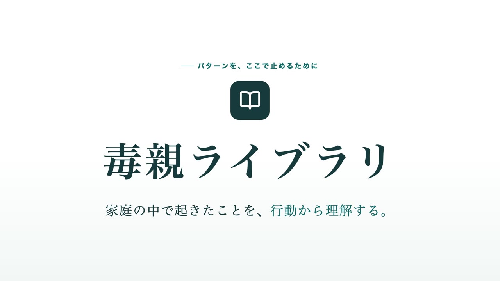

# 毒親ライブラリ

家庭内・親子関係で起こる有害な関わりを、人物ではなく「行動パターン」として整理するWebサービスです。

行動、背景、影響、境界線、代替行動を順番に提示し、家庭の中で繰り返されるパターンを次の世代へ持ち越さないことを目的としています。

## 紹介動画

[](docs/intro.mp4)

画像をクリックすると再生できます（1920×1080・約60秒・ナレーション：VOICEVOX:No.7）。

## 主な機能

- 49件の行動パターン（「死ね」「産まなきゃよかった」など実際に言われた言葉でも検索可能）
- 自由文による全文検索（表記ゆれ吸収・「〜と言われた」等の自然文・スペース区切りAND・一致度順）
- カテゴリ、年代、場面、強度による絞り込み
- 健全な関与との境界をグラデーション表示
- 養育者側の背景と子ども側への影響
- 有害な表現に代わる伝え方
- 母親、父親、祖父母、継親、養親、その他養育者に対応

## ローカル開発

```bash
pnpm install
pnpm dev
```

## ビルド

```bash
pnpm build
```

## Cloudflare Workersへのデプロイ

```bash
pnpm deploy:cloudflare
```

GitHub Actionsからデプロイする場合は、リポジトリのActions secretsへ次の値を登録します。

- `CLOUDFLARE_API_TOKEN`
- `CLOUDFLARE_ACCOUNT_ID`

`main` ブランチへのpush、または手動実行でCloudflare Workersへデプロイされます。

## 紹介動画の再生成

`video/` に台本・シーン・生成スクリプトがあります。本番サイトを Playwright で操作して1フレームずつ撮影し、ffmpeg で結合します。

- `video/script.mjs`：台本（ナレーション・字幕・各シーンの最短尺）
- `video/scenes.html`：タイトルなどの HTML アニメーション
- `video/render.mjs`：ナレーション合成 → フレーム撮影 → 結合

前提：[VOICEVOX](https://voicevox.hiroshiba.jp/) のエンジンを `127.0.0.1:50021` で起動し、ffmpeg をインストールしておきます（例：`brew install ffmpeg`）。

```bash
cd video
npm install
node render.mjs          # video/out/intro.mp4（BGMあり）と intro-nobgm.mp4 を出力
npm test                 # 尺計算のテスト
```

一部のシーンだけ撮り直す場合は `node render.mjs --only=intro,principle` のように指定します。

## 注意

「毒親」は医学的な診断名ではありません。このサービスは特定の人物を診断・評価するものではなく、親子関係で見られる行動パターンを整理することを目的としています。
