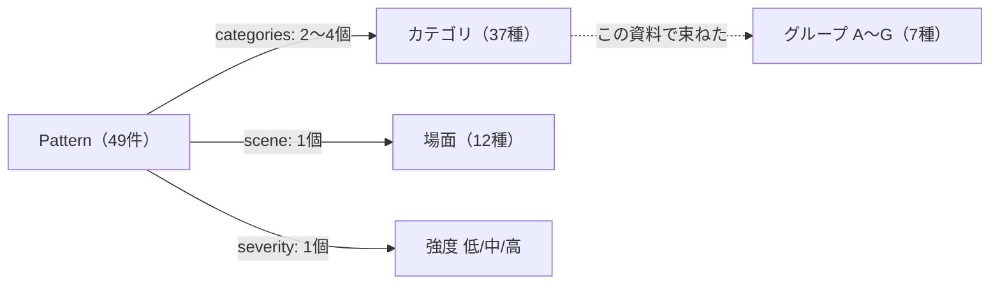
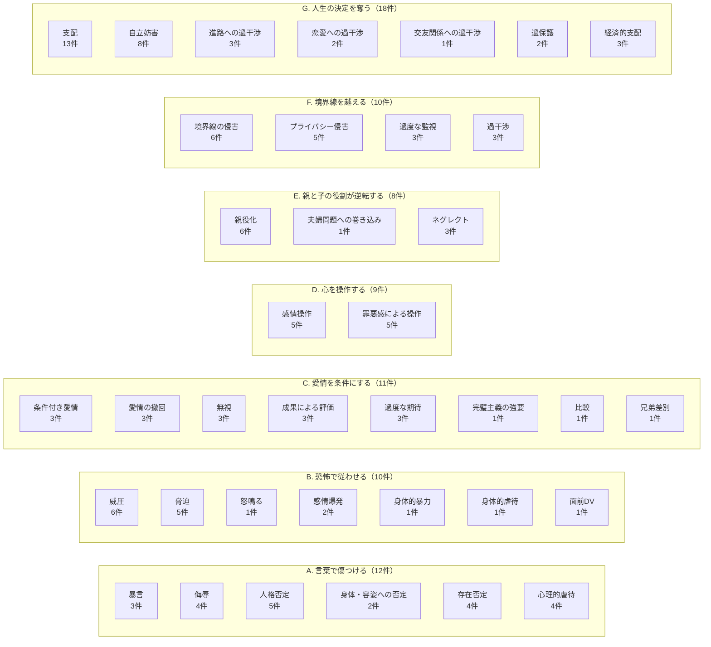
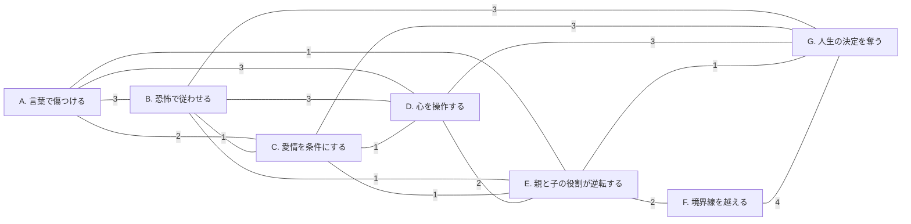
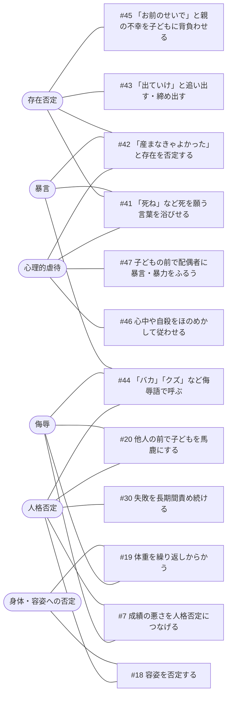
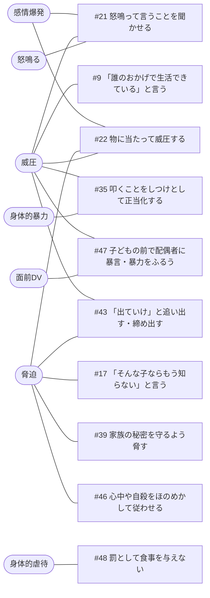
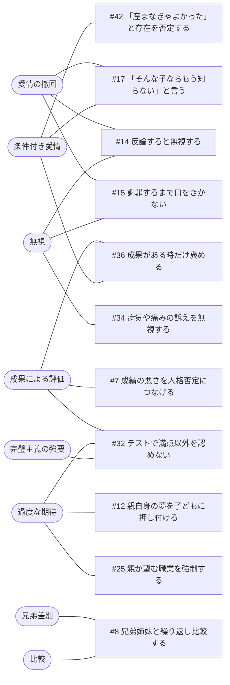
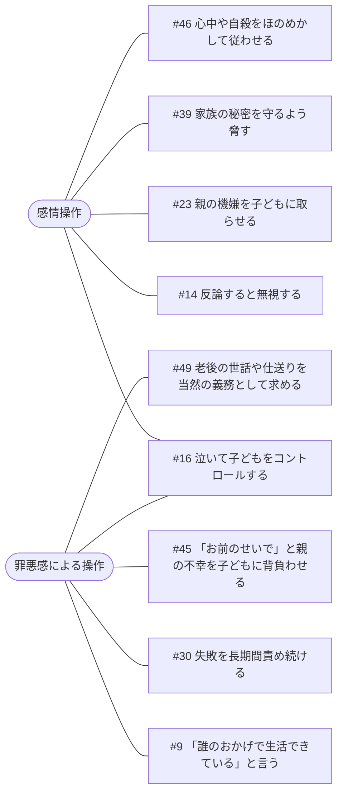
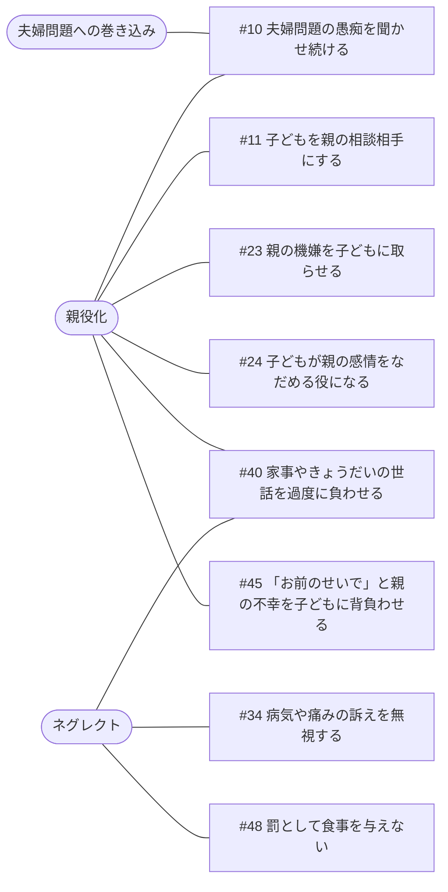
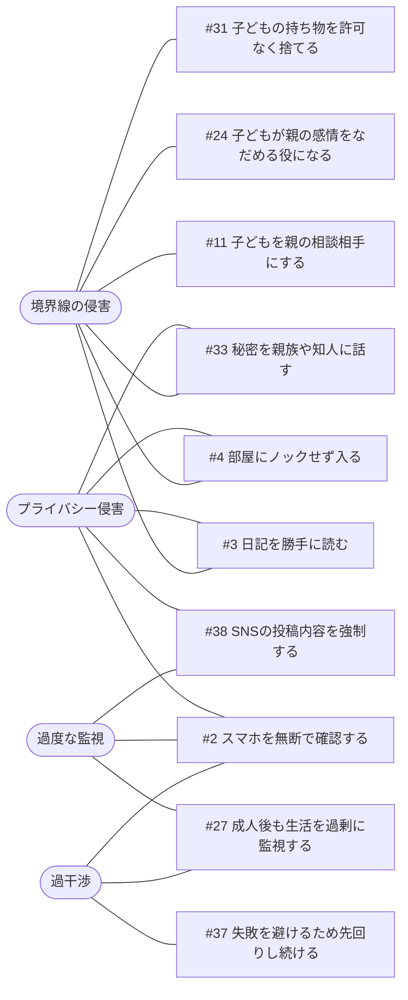
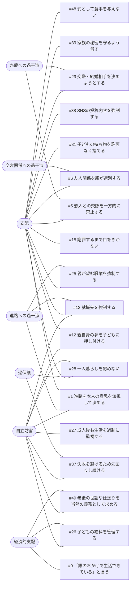

# 行動パターンとカテゴリの対応マップ

`app/data.ts` の **49 件のパターン** には、**37 種類のカテゴリ**が 1 件あたり 2〜4 個付いています（1 対多）。
カテゴリはフラットな一覧で、上位の分類はありません。そのため、ここでは意味の近いカテゴリを **7 つのグループ（A〜G）** にまとめて図にしています。
グループの定義は `app/groups.ts` にあり、サイトの **`/map`（カテゴリマップ）** ではデータから自動で集計した同じ内容を見られます。

## 1. データ構造

## 2. 全体図：グループとカテゴリ

件数は、そのグループのカテゴリを 1 つ以上持つパターンの数です（重複あり）。

## 3. グループ同士のつながり

線の数字は、両方のグループにまたがるパターンの件数です。
**F（境界線を越える）と G（人生の決定を奪う）** が最も強く結びついており、監視や過干渉が進路・自立の支配と一緒に起きやすいことを示しています。
**D（心を操作する）** は A・B・C・E・G のすべてとつながる「ハブ」です。

## 4. 3 つ以上のグループにまたがるパターン

1 つの行動に複数の有害性が重なっている例です。49 件中 25 件は 1 グループだけに属します。

| パターン | グループ | カテゴリ |
|---|---|---|
| #9 「誰のおかげで生活できている」と言う | B / D / G | 罪悪感による操作、経済的支配、威圧 |
| #39 家族の秘密を守るよう脅す | B / D / G | 脅迫、感情操作、支配 |
| #45 「お前のせいで」と親の不幸を子どもに背負わせる | A / D / E | 罪悪感による操作、存在否定、親役化 |
| #46 心中や自殺をほのめかして従わせる | A / B / D | 脅迫、感情操作、心理的虐待 |
| #48 罰として食事を与えない | B / E / G | ネグレクト、身体的虐待、支配 |

## 5. 場面 × グループ

どの場面でどの種類の関わりが起きやすいか（件数）を示します。`·` は 0 件です。

| 場面 \ グループ | A | B | C | D | E | F | G |
|---|---:|---:|---:|---:|---:|---:|---:|
| 進路・教育 | 1 | · | 5 | · | · | · | 4 |
| デジタル・交友 | · | · | · | · | · | 2 | 2 |
| 家庭生活 | 1 | 1 | · | · | 1 | 3 | 1 |
| 恋愛・結婚 | · | · | · | · | · | · | 2 |
| きょうだい | · | · | 1 | · | · | · | · |
| お金・生活 | · | 1 | · | 1 | · | · | 2 |
| 家族関係 | 2 | 2 | · | 3 | 5 | 2 | 1 |
| 会話・衝突 | 5 | 4 | 4 | 4 | · | · | 1 |
| 身体・健康 | 2 | · | 1 | · | 1 | · | · |
| 公共・親族 | 1 | · | · | · | · | 1 | · |
| 自立・成人後 | · | · | · | 1 | · | 2 | 4 |
| しつけ | · | 2 | · | · | 1 | · | 1 |

- **会話・衝突** は A〜D（言葉・恐怖・条件付き愛情・操作）に集中しています。
- **家族関係** は E（役割の逆転）が中心です。
- **進路・教育** は C（愛情を条件にする）と G（人生の決定を奪う）、**自立・成人後** は G が中心です。

## 6. グループごとの詳細（カテゴリ → パターン）

丸い箱がカテゴリ、四角い箱がパターンです。複数のグループに属するパターンは、それぞれの図に出てきます。

### A. 言葉で傷つける

### B. 恐怖で従わせる

### C. 愛情を条件にする

### D. 心を操作する

### E. 親と子の役割が逆転する

### F. 境界線を越える

### G. 人生の決定を奪う

## 7. 気づいた点

- **フィルタに出るカテゴリが 10 種類だけ**：`app/page.tsx` の絞り込みは `categories.slice(0,10)` で、しかも文字コード順です。このため最多の「支配（13件）」や「暴言」「脅迫」「感情操作」はフィルタに表示されません（下部の「関わり方の種類から探す」には全 37 種類が出ます）。
- **1 件しか使われていないカテゴリが 9 種類**あります：交友関係への過干渉、比較、兄弟差別、夫婦問題への巻き込み、怒鳴る、完璧主義の強要、身体的暴力、面前DV、身体的虐待。
- **意味が重なるカテゴリ**があります（例：暴言／侮辱／人格否定、身体的暴力／身体的虐待、過干渉／過度な監視、無視／愛情の撤回）。
- 上の 7 グループをデータに持たせる（例：`group` フィールドを追加）と、フィルタを「7 グループ → 詳細カテゴリ」の 2 段にでき、上記 3 点をまとめて解消できます。
